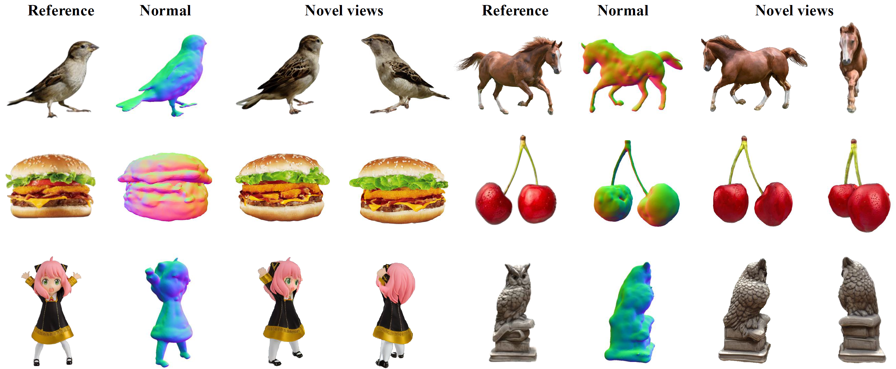
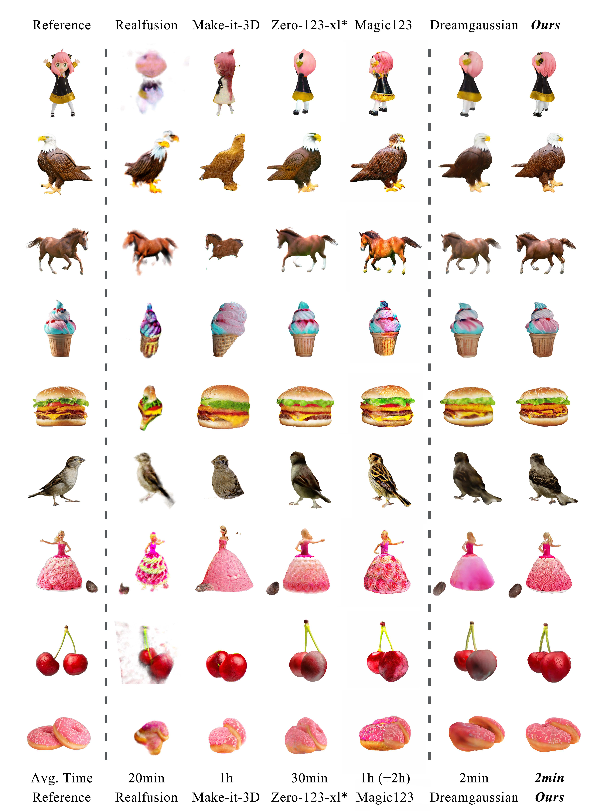
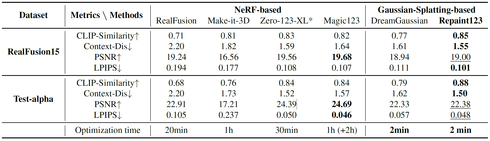

<h2 align="center"> <a href="https://github.com/junwuzhang19/repaint123">Repaint123: Fast and High-quality One Image to 3D Generation with Progressive Controllable 2D Repainting</a></h2>
<h5 align="center"> If you like our project, please give us a star ⭐ on GitHub for latest update.  </h2>

<h5 align="center">
    
[](https://arxiv.org/abs/2312.13271)
[](https://github.com/junwuzhang19/repaint123/blob/main/LICENSE) 

</h5>



## 😮 Highlights

Repaint123 crafts 3D content from a single image, matching 2D generation quality in just ***2 minutes***.

### 🔥 Simple Gaussian Splatting baseline for image-to-3D
- Coarse stage: Gaussian Splatting optimized with SDS loss by Zero123 for geometry formation.
- Fine stage: Mesh optimized with MSE loss by Stable Diffusion for texture refinement.

### 💡 View consistent, high quality and fast speed
- Stable Diffusion for high quality and controllable repainting for reference alignment   -->   view-consistent high-quality image generation.
- View-consistent high-quality images with simple MSE loss   -->   fast high-quality 3D content reconstruction.


## 🚩 **Updates**

Welcome to **watch** 👀 this repository for the latest updates.

✅ **[2023.12.21]** : We have released our paper, Repaint123 on [arXiv](https://arxiv.org/abs/2312.13271).
- [ ] [2023.12.21]: Release project page.
- [ ] Code release.
- [ ] Online Demo.


## 🤗 Demo

Coming soon!

## 🚀 Image-to-3D Results

### Qualitative comparison



### Quantitative comparison




## 👍 **Acknowledgement**
This work is built on many amazing research works and open-source projects, thanks a lot to all the authors for sharing!
* [DreamGaussian](https://github.com/dreamgaussian/dreamgaussian)
* [ControlNet](https://github.com/lllyasviel/ControlNet)
* [Repaint](https://github.com/andreas128/RePaint)
* [Diffusers](https://github.com/huggingface/diffusers)

## ✏️ Citation
If you find our paper and code useful in your research, please consider giving a star :star: and citation :pencil:.

```BibTeX
@misc{zhang2023repaint123,
    title={Repaint123: Fast and High-quality One Image to 3D Generation with Progressive Controllable 2D Repainting},
    author={Junwu Zhang and Zhenyu Tang and Yatian Pang and Xinhua Cheng and Peng Jin and Yida Wei and Wangbo Yu and Munan Ning and Li Yuan},
    year={2023},
    eprint={2312.13271},
    archivePrefix={arXiv},
    primaryClass={cs.CV}
}
```
<!---->
