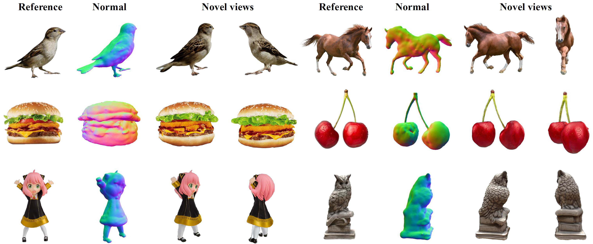
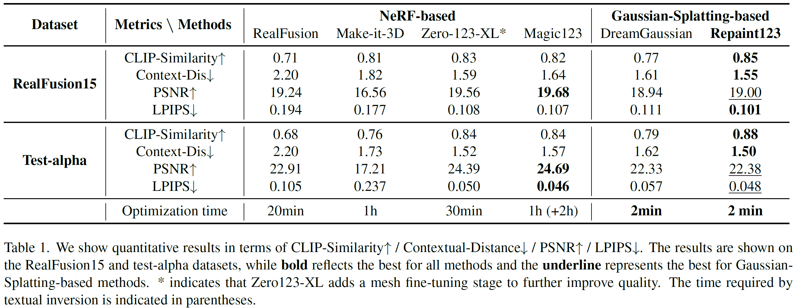

<h2 align="center"> <a href="https://github.com/PKU-YuanGroup/repaint123">Repaint123: Fast and High-quality One Image to 3D Generation with Progressive Controllable 2D Repainting (ECCV2024)</a></h2>
<h5 align="center"> If you like our project, please give us a star ⭐ on GitHub for latest update.  </h2>

<h5 align="center">

[](https://PKU-YuanGroup.github.io/repaint123/)
[](https://eccv.ecva.net/virtual/2024/poster/1312)
[](https://github.com/PKU-YuanGroup/repaint123/blob/main/LICENSE) 


</h5>

## [Project page](https://PKU-YuanGroup.github.io/repaint123/) | [Paper](https://arxiv.org/abs/2312.13271) | [Live Demo (Coming Soon)]()




## 😮 Highlights

Repaint123 crafts 3D content from a single image, matching 2D generation quality in just ***2 minutes***.

### 🔥 Simple Gaussian Splatting baseline for image-to-3D
- Coarse stage: Gaussian Splatting optimized with SDS loss by Zero123 for geometry formation.
- Fine stage: Mesh optimized with MSE loss by Stable Diffusion for texture refinement.

### 💡 View consistent, high quality and fast speed
- Stable Diffusion for high quality and controllable repainting for reference alignment   -->   view-consistent high-quality image generation.
- View-consistent high-quality images with simple MSE loss   -->   fast high-quality 3D content reconstruction.


## 🚩 **Updates**

Welcome to **watch** 👀 this repository for the latest updates.


✅ : Release [project page](https://PKU-YuanGroup.github.io/repaint123/).
✅ : Code release.

## Install

```bash
pip install -r requirements.txt

# a modified gaussian splatting (+ depth, alpha rendering)
git clone --recursive https://github.com/ashawkey/diff-gaussian-rasterization
pip install ./diff-gaussian-rasterization

# simple-knn
pip install ./simple-knn

# nvdiffrast
pip install git+https://github.com/NVlabs/nvdiffrast/

# kiuikit
pip install git+https://github.com/ashawkey/kiuikit

# To use MVdream, also install:
pip install git+https://github.com/bytedance/MVDream

# To use ImageDream, also install:
pip install git+https://github.com/bytedance/ImageDream/#subdirectory=extern/ImageDream
```

Tested on:

- Ubuntu 22 with torch 1.12 & CUDA 11.6 on a V100.
- Windows 10 with torch 2.1 & CUDA 12.1 on a 3070.

## Usage

Image-to-3D:

```bash
### preprocess
# background removal and recentering, save rgba at 256x256
python process.py data/name.jpg

# save at a larger resolution
python process.py data/name.jpg --size 512

# process all jpg images under a dir
python process.py data

### training gaussian stage
# train 500 iters (~1min) and export ckpt & coarse_mesh to logs
python main.py --config configs/image.yaml input=data/name_rgba.png save_path=name

# gui mode (supports visualizing training)
python main.py --config configs/image.yaml input=data/name_rgba.png save_path=name gui=True

# load and visualize a saved ckpt
python main.py --config configs/image.yaml load=logs/name_model.ply gui=True

# use an estimated elevation angle if image is not front-view (e.g., common looking-down image can use -30)
python main.py --config configs/image.yaml input=data/name_rgba.png save_path=name elevation=-30

### training mesh stage
# auto load coarse_mesh and refine 50 iters (~1min), export fine_mesh to logs
python main2.py --config configs/image.yaml input=data/name_rgba.png save_path=name

# specify coarse mesh path explicity
python main2.py --config configs/image.yaml input=data/name_rgba.png save_path=name mesh=logs/name_mesh.obj

# gui mode
python main2.py --config configs/image.yaml input=data/name_rgba.png save_path=name gui=True

# export glb instead of obj
python main2.py --config configs/image.yaml input=data/name_rgba.png save_path=name mesh_format=glb

### visualization
# gui for visualizing mesh
# `kire` is short for `python -m kiui.render`
kire logs/name.obj

# save 360 degree video of mesh (can run without gui)
kire logs/name.obj --save_video name.mp4 --wogui

# save 8 view images of mesh (can run without gui)
kire logs/name.obj --save images/name/ --wogui

### evaluation of CLIP-similarity
python -m kiui.cli.clip_sim data/name_rgba.png logs/name.obj
```

Please check `./configs/image.yaml` for more options.


## 🚀 Image-to-3D Results

### Qualitative comparison


### Quantitative comparison




## 👍 **Acknowledgement**
This work is built on many amazing research works and open-source projects, thanks a lot to all the authors for sharing!
* [DreamGaussian](https://github.com/dreamgaussian/dreamgaussian)
* [ControlNet](https://github.com/lllyasviel/ControlNet)
* [Repaint](https://github.com/andreas128/RePaint)
* [Diffusers](https://github.com/huggingface/diffusers)

## ✏️ Citation
If you find our paper and code useful in your research, please consider giving a star :star: and citation :pencil:.

```BibTeX
@inproceedings{zhang2024repaint123,
  title={Repaint123: Fast and high-quality one image to 3d generation with progressive controllable repainting},
  author={Zhang, Junwu and Tang, Zhenyu and Pang, Yatian and Cheng, Xinhua and Jin, Peng and Wei, Yida and Zhou, Xing and Ning, Munan and Yuan, Li},
  booktitle={European Conference on Computer Vision},
  pages={303--320},
  year={2024},
  organization={Springer}
}
```
<!---->